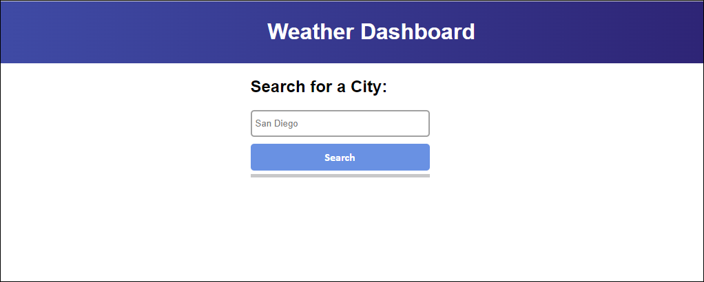
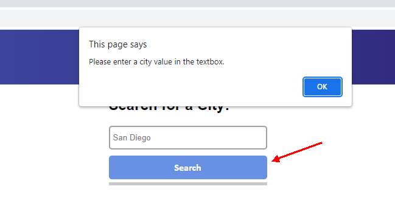
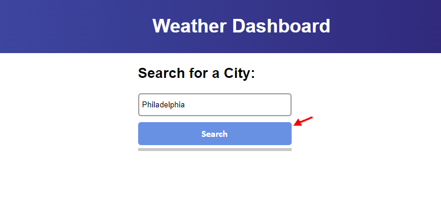
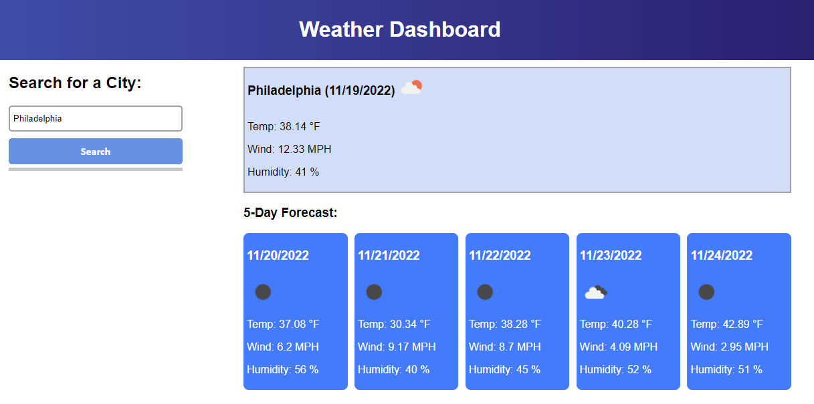
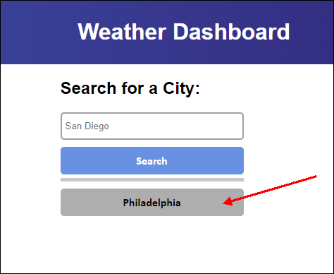
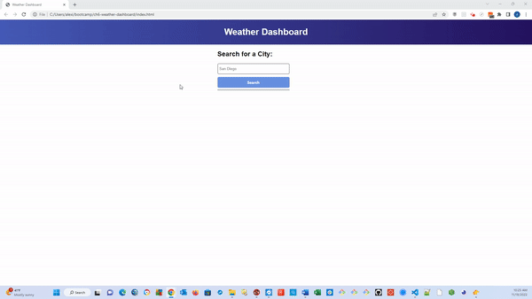

#  Weather Dashboard Using Server Side APIs


## Description

```md
This application uses server side APIs, such as the 5 day weather forecast API, 
to allow users to retrieve weather data for cities.  

User Story
AS A traveler
I WANT to see the weather outlook for multiple cities
SO THAT I can plan a trip accordingly

Acceptance Criteria
GIVEN a weather dashboard with form inputs
WHEN I search for a city
THEN I am presented with current and future conditions for that city and that city is added to the search history
WHEN I view current weather conditions for that city
THEN I am presented with the city name, the date, an icon representation of weather conditions, the temperature, the humidity, and the wind speed
WHEN I view future weather conditions for that city
THEN I am presented with a 5-day forecast that displays the date, an icon representation of weather conditions, the temperature, the wind speed, and the humidity
WHEN I click on a city in the search history
THEN I am again presented with current and future conditions for that city

```

## Table of Contents

- [Description](#description)
- [Installation](#installation)
- [Usage](#usage)
- [Credits](#credits)
- [License](#license)
- [Features](#features)
- [How-to-Contribute](#how-to-contribute)
- [Tests](#test-instructions)
- [Questions](#questions)

## Installation

```md
N/A
```

## Usage

Here's a link to this application in GitHub:
https://abrownstein2022.github.io/weather-dashboard/

```md
If you have not already used this application in your browser, enter a city name in the input box in the 
middle of the screen, and click on the Search button.  Weather data for your entered city will appear to
the right.  This city name will also be stored in local storage and appear as a button the next time you 
use the application.  This applicatoin shows up to the last 8 cities you seached for as search buttons 
below the input box and first search button.  If you wish to see the weather for any of your last 8 city 
searches, just click on the button with that city name.  If you press the Search button but did not 
enter a city name in the input box, you see a message asking you to enter a city name.
```













## Credits

```md
Alexis Brownstein, bootcamp instructor, TAs and Tutor 
```

## License

 ```md
 MIT 
```

Link to license text:
https://opensource.org/licenses/mit-license


## Features

```md
The main features in this project are:
entering a city name and saving up to your last 8 city searches, 
validation for empty input box, clean and pretty interface
```

## How-to-Contribute

```md
n/a
```

## Test Instructions

```md
n/a
```

## Questions

```md
Feel free to contact me with any questions.

My email is: alexis@drdatabase.com.
```

My GitHub Profile link:
  
  https://github.com/abrownstein2022
 
